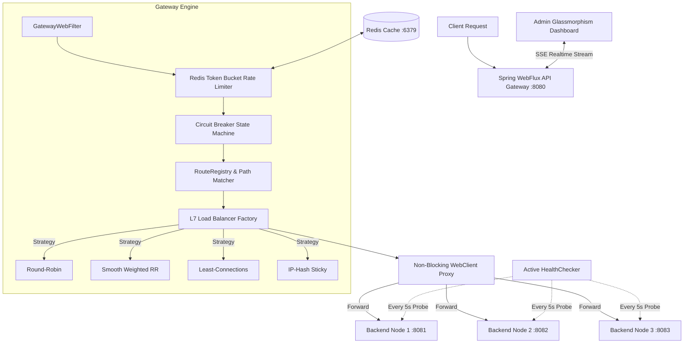

# ⚡ High-Performance L7 API Gateway & Load Balancer

A production-grade, non-blocking L7 API Gateway and Load Balancer built with **Spring Boot 3**, **Java 17**, **Spring WebFlux (Netty Event Loop)**, **Redis (Atomic Lua Token Bucket)**, **Custom Circuit Breaker**, and a **Real-Time Glassmorphism Admin Dashboard**.

---

## 🏛️ System Architecture



---

## 🌟 Key Features

### 1. Non-Blocking Event-Driven Proxy Engine
* Built on **Spring WebFlux & Netty** (asynchronous event loops).
* Handles thousands of concurrent proxy requests per CPU core without thread-per-request blocking.
* Asynchronously streams HTTP payloads (`Flux<DataBuffer>`) and response headers back to client.

### 2. Pluggable L7 Load Balancing Strategies
* **Round-Robin:** Atomic modulo rotation across healthy instances.
* **Smooth Weighted Round-Robin (Nginx Algorithm):** Interleaves requests proportionally based on backend capacity without traffic spikes.
* **Least-Connections:** Routes requests to the node with the lowest active in-flight connection count.
* **IP-Hash (Sticky Sessions):** Maps client IP (`X-Forwarded-For` / Socket IP) to a deterministic node for session affinity.

### 3. Distributed Atomic Rate Limiting (Redis + Lua)
* Implements the **Token Bucket** algorithm using an atomic **Redis Lua Script**.
* Guarantees zero race conditions across distributed gateway clusters.
* Appends `X-RateLimit-Limit` and `X-RateLimit-Remaining` headers; returns `HTTP 429` when exceeded.
* **In-Memory Fallback:** Automatically degrades to internal memory buckets if Redis becomes unreachable.

### 4. Circuit Breaker & Resiliency Machine
* Three-State Machine: `CLOSED` $\rightarrow$ `OPEN` $\rightarrow$ `HALF_OPEN`.
* Short-circuits requests (`HTTP 503`) when failure threshold ($\ge 50\%$) is breached.
* Automatic self-healing probe trial after 10-second wait window.
* Isolated per-route instances prevent cascading outages.

### 5. Active & Passive Health Checking
* **Active:** Scheduled WebFlux task pings `/actuator/health` every 5 seconds.
* **Passive:** Evicts nodes after 3 consecutive network failures or 5xx server errors.

### 6. Real-Time Admin Analytics & Dashboard (`http://localhost:8080/admin/index.html`)
* **Real-time Telemetry:** Reactive Server-Sent Events (SSE) stream pushing live RPS, latency, and status metrics every second.
* **Zero-Downtime Reconfiguration:** Dynamically change load balancing algorithms or backend weights on the fly!

---

## 🚀 Quick Start (Docker Compose)

Spin up the gateway, Redis, and 3 backend mock microservices with a single command:

```bash
docker compose up -d
```

### Access Points
* **Admin Dashboard:** `http://localhost:8080/admin/index.html`
* **API Gateway Proxy (User Service):** `http://localhost:8080/api/v1/users/123`
* **Gateway Prometheus Metrics:** `http://localhost:8080/actuator/prometheus`


```
